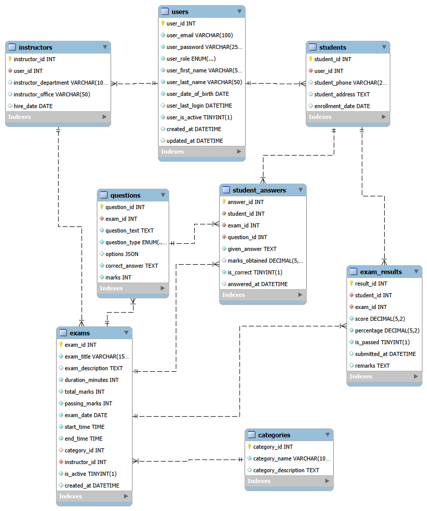

# Online Examination System 

> Developed by **Ahmed Medhat**

---
## Project Overview
**Online Examination System** is a full-stack web application designed to digitize the exam creation, execution, and evaluation process for educational institutions. It enables instructors to create timed exams with multiple-choice and short-answer questions, while students can take exams remotely and receive instant results.

**Developed by:** Ahmed Medhat
**Project Type:** Full‑Stack Web Application
**License:** Proprietary – All rights reserved

<div align="center">
  
</div>

---
## Project Structure

### ONLINE-EXAMINATION-SYSTEM
```js
online-examination-system/
├── client/
├── database/
├── public/
├── server/
└── README.md
```

### Frontend (React.js + Vite)
```js
client/
├── node_modules/
├── public/
│   └── sutech-logo.jpg
├── src/
├── .gitignore
├── eslint.config.js
├── index.html
├── package-lock.json
├── package.json
└── vite.config.js
```

### Database (MySQL)
```js
database/
├── online-examination-system_erd.mwb
├── online-examination-system_erd.pdf
├── online-examination-system-erd.svg
└── schema.sql
```

### Backend (Express.js)
```js
server/
├── apis/
│   └── authRoutes.js
├── app/
│   ├── controllers/
│   │   └── authController.js
│   ├── middlewares/
│   │   └── authMiddleware.js
│   ├── models/
│   │   └── User.js
│   └── validations/
│       └── authValidation.js
├── config/
│   └── database.js
├── node_modules/
├── tests/
│   └── test-connection.test.js
├── utils/
│   ├── cookieHelper.js
│   └── jwt.js
├── .env
├── .gitignore
├── app.js
├── package-lock.json
└── package.json
```

---
## Technologies Used

### Frontend Technologies
| Technology                                                                                                                | Purpose                           | Version |
| ------------------------------------------------------------------------------------------------------------------------- | --------------------------------- | ------- |
|                        | Frontend JavaScript Library       | 18.x    |
|             | CSS Framework for Styling         | 5.x     |
|                         | HTTP Client for API Calls         | 1.x     |
|    | Client-side Routing               | 6.x     |
|    | Icon Library                      | 6.x     |

### Backend Technologies
| Technology                                                                                                                | Purpose                           | Version |
| ------------------------------------------------------------------------------------------------------------------------- | --------------------------------- | ------- |
|                 | JavaScript Runtime Environment    | 18.x+   |
|             | Web Application Framework         | 4.x     |
|                  | API Rate Limiting Middleware      | 7.x     |
|                      | Security Headers Middleware       | 7.x     |
|                            | Cross-Origin Resource Sharing     | 2.x     |
|                      | Password Hashing Library          | 5.x     |
|                    | Cookie Parsing Middleware         | 1.x     |
|                      | HTTP Request Logger               | 1.x     |
|                   | Development Server Auto-Restart   | 3.x     |
|                      | Environment Variables Loader      | 16.x    |
|                     | JSON Web Tokens Authentication    | 9.x     |
|                       | MySQL Database Driver             | 3.x     |

### Database & Tools
| Technology                                                                                                                | Purpose                           | Version |
| ------------------------------------------------------------------------------------------------------------------------- | --------------------------------- | ------- |
|                         | Relational Database               | 8.x     |
|     | Database Design & Management      | 8.x     |

---

## Installation

### Frontend Dependencies
**Step 1. Setup React (JavaScript) + Vite Project:**
```bash
npm create vite@latest
```

**Step 2: Navigate and install dependencies:**
```bash
cd client
npm install
```

**Step 3: Install all dependencies:**
```bash
# React Router DOM
npm install react-router-dom

# Bootstrap 5
npm install bootstrap

# Font Awesome (all icon packages)
npm install @fortawesome/fontawesome-svg-core
npm install @fortawesome/free-solid-svg-icons
npm install @fortawesome/free-regular-svg-icons
npm install @fortawesome/free-brands-svg-icons
npm install @fortawesome/react-fontawesome
```

## Backend Dependencies
**Step 1. Setup Express.js Project:**
```bash
cd server
npm i -y
```

**Step 2: Install all dependencies:**
```bash
npm install express mysql2 dotenv cors helmet morgan cookie-parser bcrypt jsonwebtoken express-rate-limit

npm install -D nodemon
```

---
## Core Features
### Authentication & Authorization
* JWT‑based authentication
* Role‑based access control (User / Admin)
* Secure password hashing with **bcrypt**
* Protected routes and APIs
* Secure session handling

---
# API Documentation
## Base URL
```bash
http://localhost:PORT/api/auth
```

## Authentication
1. Register - POST base_url/register
2. Login - POST base_url/login
3. Get Current User - GET base_url/current-user
4. Update Profile - PUT base_url/profile
5. Change Password - PUT base_url/change-password
6. Logout - POST base_url/logout
7. Login Again - POST base_url/login
8. Deactivate Account - DELETE base_url/account

---
## License
**PROPRIETARY LICENSE**
© 2026 Ahmed Medhat. All Rights Reserved.
This project is a personal, non-commercial work created solely for the purpose of demonstrating full-stack web development skills.

*This software and associated documentation are proprietary and confidential. No part of this project may be reproduced, distributed, or transmitted in any form without prior written permission from the author.*

---
## Author
* **Ahmed Medhat** – Junior Full Stack JavaScript Developer